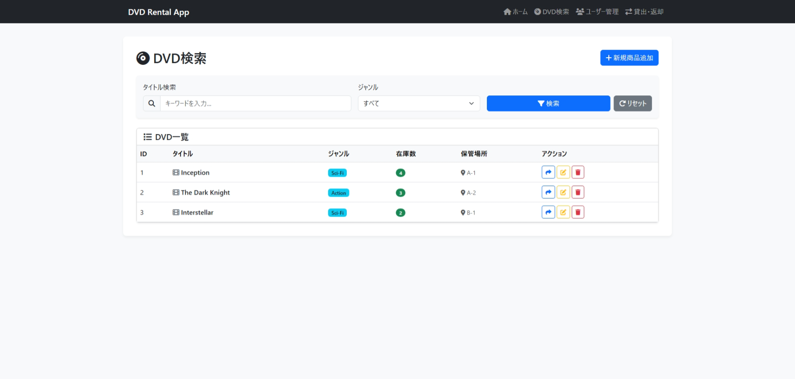
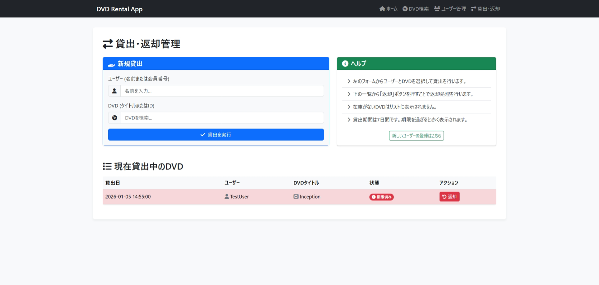

# DVD Rental App (DVDレンタル管理システム)


## 概要

Flaskを使用したDVDレンタル管理Webアプリケーションです。
ユーザー管理、DVD在庫管理、貸出・返却処理を直感的な操作で行うことができます。

本アプリケーションは、プログラミング学習や小規模なレンタル管理業務のプロトタイプとして設計されています。

---

## プロジェクト構成

- **バックエンド:** Flask (Python)
- **データベース:** SQLite
- **環境構築:** Docker / Docker Compose

### 主なファイル・ディレクトリ
- `app.py`: アプリケーションのメインロジック（ルーティング、DB操作）
- `templates/`: 画面のHTMLテンプレート（Jinja2）
- `dvd_rental.db`: SQLiteデータベースファイル
- `ER図/`: データベース設計書（SchemaSpyにより生成）
- `docker-compose.yml`: Docker環境での起動設定
- `Dockerfile`: アプリケーションコンテナの定義

---

## 起動方法

### Dockerを使用する場合 (推奨)
Docker Desktopなどがインストールされている環境であれば、以下のコマンドですぐに起動できます。

1. **起動**
   ```bash
   docker compose up
   ```
   初回起動時はビルドが行われます。

2. **アクセス**
   ブラウザで `http://localhost:80` (または設定によりポートが異なる場合があります) にアクセスしてください。

3. **終了**
   ```bash
   docker compose down
   ```

### ローカルPython環境で起動する場合
Pythonがインストールされている場合、以下の手順で起動可能です。

1. **依存ライブラリのインストール**
   ```bash
   pip install -r requirements.txt
   ```

2. **データベースの初期化** (初回のみ)
   ```bash
   python init_db.py
   ```

3. **アプリの起動**
   ```bash
   python app.py
   ```
   ブラウザで `http://localhost:5000` にアクセスしてください。

---

## 機能・画面紹介

### 1. ダッシュボード (ホーム)
システムの利用状況を一目で確認できるダッシュボードです。
- 登録ユーザー数、DVD数、貸出中件数
- 最近のレンタル履歴


### 2. DVD管理
在庫DVDの検索、新規登録、編集、削除機能を提供します。
- タイトルやジャンルによる絞り込み検索
- 在庫数や保管場所の管理



### 3. ユーザー管理
会員情報の管理を行います。
- 会員の新規登録、編集、削除
- 貸出履歴がある会員の保護（削除防止）


### 4. 貸出・返却
シンプルな操作で貸出と返却の処理が行えます。
- ユーザーとDVDを選択して貸出
- 未返却一覧からのワンクリック返却処理



---

## データベース設計 (ER図)

本システムのデータベース構造は、相互に関連する4つのテーブルで構成されています。


### テーブル詳細とリレーションシップ

1. **genres (ジャンルテーブル)**
   - DVDのカテゴリー（アクション、コメディ等）を管理します。
   - `genre_id` を主キーとして持ちます。

2. **dvds (DVDテーブル)**
   - DVDのタイトル、在庫数、保管場所などの情報を管理します。
   - `genre_id` カラムを通じて **genres** テーブルと紐付いています（多対一）。これにより、各DVDは必ず一つのジャンルに属します。

3. **users (ユーザーテーブル)**
   - 会員の名前、住所、電話番号、会員コードなどを管理します。
   - `user_id` を主キー、`member_code` を一意識別子として持ちます。

4. **rentals (レンタルテーブル)**
   - 貸出・返却のトランザクションを記録する中間テーブル的な役割を果たします。
   - `user_id` を通じて **users** テーブルと、`dvd_id` を通じて **dvds** テーブルと紐付いています（多対多の解消）。
   - 貸出日、返却予定日（または返却日）、現在のステータス（貸出中・返却済）を保持します。

---

## デモ動画

システムの操作イメージについては、以下の動画をご覧ください。


