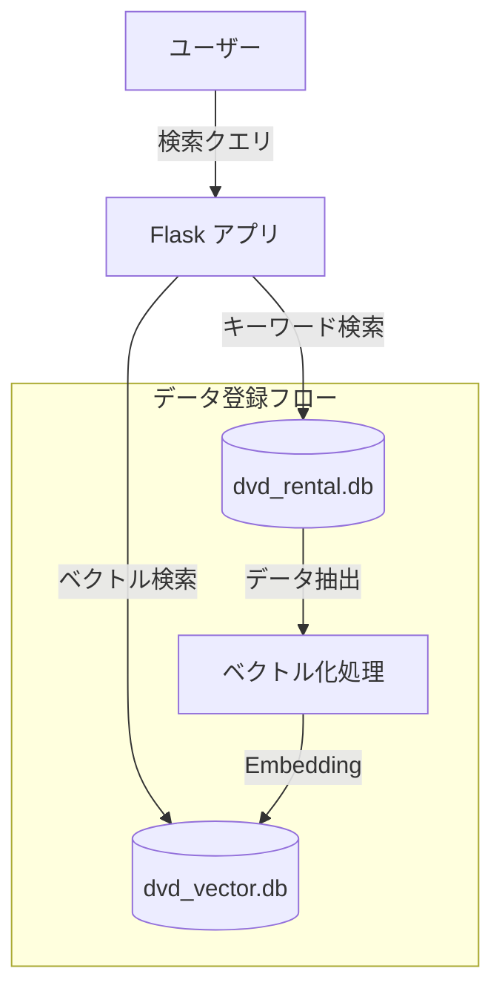
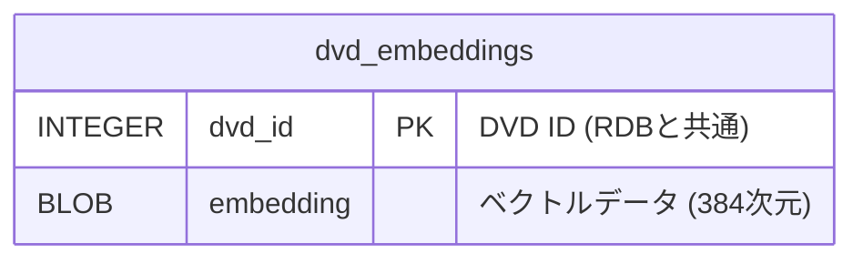

# DVD Rental App (DVDレンタル管理システム)


## 概要

Flaskを使用したDVDレンタル管理Webアプリケーションです。
ユーザー管理、DVD在庫管理、貸出・返却処理を直感的な操作で行うことができます。

本アプリケーションは、プログラミング学習や小規模なレンタル管理業務のプロトタイプとして設計されています。

---

## ペルソナ


- **氏名:** 山田 勇太
- **年齢:** 38歳
- **職業:** 個人経営のDVDレンタルショップ店主
- **店舗規模:** 地域密着型・1店舗のみ
- **スタッフ:** 基本1人、忙しい時間帯だけ家族が手伝う
- **ITリテラシー:** PC操作は問題なく、Excelや簡易ソフトは使える。<br>　　　　　　 クラウド型・高度な業務システムは未導入。

＜現在の運営状況＞
- 会員カードはある
- 会員情報はPCで管理しているが、システムが古い
- 貸出履歴の検索が遅い
- 返却日を見て、頭 or 電卓で確認
- 忙しい時にミスが起きやすい
- 商品管理も最低限
- 在庫数は分かるが「誰に貸しているか」「返却予定日」の紐づけが弱い

---

## プロジェクト構成

- **バックエンド:** Flask (Python)
- **データベース:** SQLite
- **環境構築:** Docker / Docker Compose

### 主なファイル・ディレクトリ
- `app.py`: アプリケーションのメインロジック（ルーティング、DB操作）
- `templates/`: 画面のHTMLテンプレート（Jinja2）
- `dvd_rental.db`: SQLiteデータベースファイル
- `dvd_vector.db`: ベクトルデータベースファイル
- `vector_search.py`: ベクトル検索ロジックの実装
- `init_vector_db.py`: ベクトルデータベースの初期化スクリプト
- `ER図/`: データベース設計書（SchemaSpyにより生成）
- `docker-compose.yml`: Docker環境での起動設定
- `Dockerfile`: アプリケーションコンテナの定義

---

## 起動方法

### Dockerを使用する場合 (推奨)
Docker Desktopなどがインストールされている環境であれば、以下のコマンドですぐに起動できます。

1. **起動**
   ```bash
   docker compose up
   ```
   初回起動時はビルドが行われます。

2. **アクセス**
   ブラウザで `http://localhost:80` (または設定によりポートが異なる場合があります) にアクセスしてください。

3. **終了**
   ```bash
   docker compose down
   ```

### ローカルPython環境で起動する場合
Pythonがインストールされている場合、以下の手順で起動可能です。

1. **依存ライブラリのインストール**
   ```bash
   pip install -r requirements.txt
   ```

2. **データベースの初期化** (初回のみ)
   ```bash
   python init_db.py
   ```
   
   **ベクトルDBの初期化** (AI検索を使用する場合)
   ```bash
   python init_vector_db.py
   ```

3. **アプリの起動**
   ```bash
   python app.py
   ```
   ブラウザで `http://localhost:5000` にアクセスしてください。

---

## 機能・画面紹介

### 1. ダッシュボード (ホーム)
システムの利用状況を一目で確認できるダッシュボードです。
- 登録ユーザー数、DVD数、貸出中件数
- 最近のレンタル履歴


### 2. DVD管理
在庫DVDの検索、新規登録、編集、削除機能を提供します。
- **AI検索 (RAG / ベクトル検索)**: 「泣ける映画」「家族で楽しめる」といった曖昧なキーワードから、内容に関連するDVDを検索できます。
- **キーワード検索**: タイトルによる完全・部分一致検索も可能です。
- 在庫数や保管場所の管理


### 3. ユーザー管理
会員情報の管理を行います。
- 会員の新規登録、編集、削除
- 貸出履歴がある会員の保護（削除防止）


### 4. 貸出・返却
シンプルな操作で貸出と返却の処理が行えます。
- ユーザーとDVDを選択して貸出
- 未返却一覧からのワンクリック返却処理


---

## データベース設計 (ER図)

本システムのデータベース構造は、相互に関連する4つのテーブルで構成されています。


### テーブル詳細とリレーションシップ

1. **genres (ジャンルテーブル)**
   - DVDのカテゴリー（アクション、コメディ等）を管理します。
   - `genre_id` を主キーとして持ちます。

2. **dvds (DVDテーブル)**
   - DVDのタイトル、在庫数、保管場所などの情報を管理します。
   - `genre_id` カラムを通じて **genres** テーブルと紐付いています（多対一）。これにより、各DVDは必ず一つのジャンルに属します。

3. **users (ユーザーテーブル)**
   - 会員の名前、住所、電話番号、会員コードなどを管理します。
   - `user_id` を主キー、`member_code` 一意識別子として持ちます。

4. **rentals (レンタルテーブル)**
   - 貸出・返却のトランザクションを記録する中間テーブル的な役割を果たします。
   - `user_id` を通じて **users** テーブルと、`dvd_id` を通じて **dvds** テーブルと紐付いています（多対多の解消）。
   - 貸出日、返却予定日（または返却日）、現在のステータス（貸出中・返却済）を保持します。

---

## ベクトル検索システムの設計

本システムでは、RDB (`dvd_rental.db`) とは独立した SQLite データベース (`dvd_vector.db`) を使用してベクトルデータを管理しています。

### アーキテクチャ

RDBで管理されるDVDのメタデータ（タイトル、ジャンル、説明文）を結合・整形し、Embeddingモデル (`sentence-transformers`) を介してベクトル化します。生成されたベクトルは、DVDのIDと紐づけてベクトルストアに保存されます。



### ベクトルDB設計 (ER図)

ベクトルDBは、DVD IDをキーとして高次元ベクトル（BLOBデータ）を格納するシンプルな構造を採用しています。



- **dvd_id**: `dvd_rental.db` の `dvds` テーブルの `dvd_id` と 1:1 で対応します。
- **embedding**: `paraphrase-multilingual-MiniLM-L12-v2` モデルによって生成された384次元の浮動小数点数配列を、バイナリ形式 (BLOB) で保存しています。

### 実装コード解説

本機能は主に以下のPythonファイルによって実装されています。

| ファイル名 | 役割 | 主な実装内容 |
| :--- | :--- | :--- |
| `vector_search.py` | **検索エンジン** | `VectorSearch` クラスを定義。SQLiteへのベクトル保存、コサイン類似度計算による検索ロジックを提供します。 |
| `init_vector_db.py` | **初期化・登録** | `sentence-transformers` ライブラリを使用して、DVDの説明文・タイトル・ジャンルをベクトル化し、DBへ保存します。 |
| `app.py` | **検索・統合** | ユーザーからのクエリを受け取り、`VectorSearch` クラスを呼び出します。さらにキーワード一致によるスコア補正（ハイブリッド検索）を行い、最終的な結果を生成します。 |

---

## デモ動画

システムの操作イメージについては、以下の動画をご覧ください。

https://github.com/user-attachments/assets/f74a48bd-25ad-4134-8695-52543887a315

---

## データベース講義内容の適用解説

本システムは大学のデータベース講義で扱われた概念を実戦的に取り入れています。以下に各項目と、対応するソースコードの箇所を解説します。

### #3 RDB Table (リレーショナルデータベースのテーブル構造)
データは意味のある単位（エンティティ）ごとに「テーブル」として分割・整理されています。
- **対応コード:** `dvd_rental_app/init_db.py` (11-56行目付近) 内の `CREATE TABLE` 文
  ```python
  # 独立したエンティティごとにテーブルを定義
  cursor.execute('CREATE TABLE IF NOT EXISTS genres (...)')
  cursor.execute('CREATE TABLE IF NOT EXISTS users (...)')
  cursor.execute('CREATE TABLE IF NOT EXISTS dvds (...)')
  cursor.execute('CREATE TABLE IF NOT EXISTS rentals (...)')
  ```

### #4 SQL, Transaction (SQL操作とトランザクション)
データの整合性を保つため、複数の更新処理を一つの不可分な単位（トランザクション）として扱っています。
- **対応コード:** `dvd_rental_app/app.py` (422-452行目付近) の `rent_dvd()` 関数
  ```python
  # トランザクションの開始
  conn.execute('BEGIN TRANSACTION')
  # 1. レンタル情報の記録 (INSERT)
  conn.execute('INSERT INTO rentals (user_id, dvd_id) VALUES (?, ?)', (user_id, dvd_id))
  # 2. 在庫数の減算 (UPDATE)
  conn.execute('UPDATE dvds SET stock_count = stock_count - 1 WHERE dvd_id = ?', (dvd_id,))
  # 全て成功すれば確定
  conn.commit()
  ```

### #5 Foreign Key, JOIN, SubQuery (外部キーと結合)
テーブル間の関連付けと、それらを統合したデータ取得を行っています。
- **対応コード (外部キー):** `dvd_rental_app/init_db.py` (43行目付近)
  ```sql
  FOREIGN KEY (genre_id) REFERENCES genres (genre_id) -- 参照整合性の確保
  ```
- **対応コード (結合):** `dvd_rental_app/app.py` (93-98行目付近) の `index()` 関数
  ```sql
  -- rentals, users, dvds の3テーブルを結合して表示用データを取得
  SELECT r.*, u.name as user_name, d.title as dvd_title 
  FROM rentals r
  JOIN users u ON r.user_id = u.user_id
  JOIN dvds d ON r.dvd_id = d.dvd_id
  ```

### #8 正規化, DB Tuning
データの重複を排除する「正規化」と、検索を高速化する「インデックス」を考慮しています。
- **正規化:** ジャンル名を `dvds` テーブルに直接持たせず `genres` テーブルに切り出すことで、ジャンル名変更時の更新負荷を最小限に抑えています（第3正規形）。
- **DB Tuning:** `dvd_rental_app/init_db.py` にて `member_code` や `phone` に `UNIQUE` 制約を付与し、自動的に高速な検索用インデックスが作成されるようにしています。

### #10 分散DB, 列指向DB (システムへの適用可能性)
- **分散DB:** 現在は SQLite ですが、利用者が増えた場合に PostgreSQL などの分散型 RDB へ移行することで、負荷分散と可用性向上が図れる設計になっています。
- **列指向DB:** 貸出履歴を数年分蓄積し、マーケティング分析（どの層がどのジャンルを好むか等）を行う際は、BigQueryのような列指向DBへデータを同期して分析する構成が有効です。

### #11 Vector DB (RAG), OTA
- **Vector DB (RAG):** 実際に実装済みです。`dvds` テーブルの `description`（説明文）を `sentence-transformers` (多言語モデル) を用いてベクトル化し、SQLiteベースの独自ベクトルストアに保存しています。
    *   **ハイブリッド検索**: 単純なベクトル検索に加え、キーワード一致によるスコアブースト（重み付け）を導入しています。これにより、「ジブリ」などの固有名詞での検索精度を大幅に向上させています。
    *   **コンテキスト重視**: タイトルやジャンル情報もあわせてベクトル化することで、より多角的なセマンティック検索を可能にしています。
- **OTA (Over-the-Air):** Docker を利用しているため、コンテナイメージを入れ替えるだけで、稼働中のシステムを最新状態へ OTA 更新できる環境になっています。
