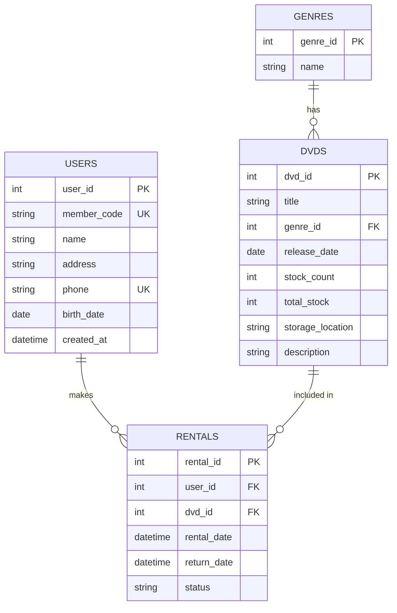

# ER図 (Entity Relationship Diagram)

本システムで使用しているデータベース(`dvd_rental.db`)のER図です。

## テーブル詳細

### users (会員テーブル)
- **user_id**: 主キー。自動採番。
- **member_code**: 会員コード。ユニーク制約。
- **name**: 会員名。
- **address**: 住所。
- **phone**: 電話番号。ユニーク制約。
- **birth_date**: 生年月日。
- **created_at**: 登録日時。

### genres (ジャンルテーブル)
- **genre_id**: 主キー。自動採番。
- **name**: ジャンル名（Action, Comedyなど）。

### dvds (DVD商品テーブル)
- **dvd_id**: 主キー。自動採番。
- **title**: タイトル。
- **genre_id**: ジャンルID。外部キー。
- **release_date**: 発売日。
- **stock_count**: 現在の在庫数。
- **total_stock**: 総在庫数。
- **storage_location**: 保管場所。
- **description**: 説明。

### rentals (貸出履歴テーブル)
- **rental_id**: 主キー。自動採番。
- **user_id**: 会員ID。外部キー。
- **dvd_id**: DVD ID。外部キー。
- **rental_date**: 貸出日時。
- **return_date**: 返却日時。NULLの場合は貸出中。
- **status**: 状態（rented, returnedなど）。
